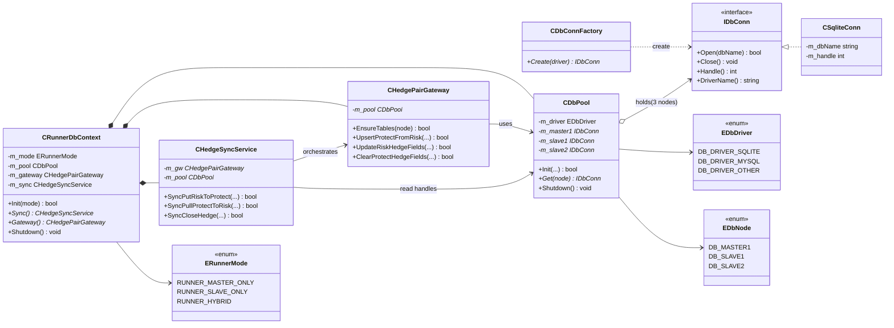

# feature01：database 结构（已反映到代码）

> 本版已把 DB 关联改动落到 `feature01`，并加入“当前 SQLite、未来 MySQL/其他数据库可扩展”的兼容点。

## 1. 当前已落地的结构

- `enums.mqh`
  - `EDbNode`：`MASTER1/SLAVE1/SLAVE2`
  - `ERunnerMode`：`MASTER_ONLY/SLAVE_ONLY/HYBRID`
  - `EDbDriver`：`SQLITE/MYSQL/OTHER`
- `IDbConn.mqh`
  - 统一数据库连接接口（`Open/Close/Handle/DriverName`）
- `CSqliteConn.mqh`
  - SQLite 实现
- `CDbConnFactory.mqh`
  - 根据 `EDbDriver` 创建连接对象（当前 mysql/other 先回退 sqlite）
- `CDbPool.mqh`
  - 管理 `master1/slave1/slave2` 连接
- `CHedgePairGateway.mqh`
  - 表级 SQL（`risk_hedgePair/protect_hedgePair`）
- `CHedgeSyncService.mqh`
  - 流程级同步（`Put/Pull/Close`）
- `CRunnerDbContext.mqh`
  - 按运行模式装配 DB 连接与同步服务

---

## 2. 与图一致的 3 个流程（已入代码）

1. `SyncPutRiskToProtect(master -> slave)`
2. `SyncPullProtectToRisk(slave -> master)`
3. `SyncCloseHedge(slave)`

`CRunnerCtl` 中已接入上述流程，按 `FEATURE_DB_RUNNER_MODE` 执行 `slave1/slave2` 路径。

---

## 3. 为“未来支持 MySQL/其他 DB”预留的兼容点

1. **连接抽象层**：通过 `IDbConn` 隔离具体数据库。
2. **工厂创建**：通过 `CDbConnFactory` 统一创建连接对象。
3. **业务流程不依赖具体驱动**：`CHedgeSyncService` 只调用 `Gateway`。
4. **配置驱动化**：通过 `DB_DRIVER_TYPE` 切换驱动（当前默认 sqlite）。

> 后续如果接入 MySQL，只需新增 `CMySqlConn : IDbConn` 并在 Factory 注册，不需要改 Runner 流程层。

---

## 4. 本次新增配置（CHeader）

- `DB_DRIVER_TYPE`
- `DB_MASTER1_NAME`
- `DB_SLAVE1_NAME`
- `DB_SLAVE2_NAME`
- `FEATURE_DB_RUNNER_MODE`
- `FEATURE_MASTER_MODEL_KIND`
- `FEATURE_SLAVE_MODEL_KIND`
- `FEATURE_CLOSE_STATUS`

---

## 5. 说明

- 当前仓库原有 `CDatabase` 仍保留，避免一次性大改导致回归风险。
- `feature01` 相关 DB 关联已通过 `CRunnerDbContext + CHedgeSyncService` 单独接入。

## 6. PR運用メモ

- 本設計は `feature01` へ段階的に適用する前提で、旧 `CDatabase` 経路との共存期間を許容する。
- 次段階では `IDbConn` 実装として `CMySqlConn` を追加し、Factory 登録のみで切替可能にする。

## 7. database目录 类结构关系图

> 读图说明：`CRunnerDbContext` 是入口，内部组合 `Pool + Gateway + SyncService`；
> `SyncService` 负责 Put/Pull/Close 流程编排，`Gateway` 负责表级 SQL，`Pool` 负责多节点连接生命周期。

